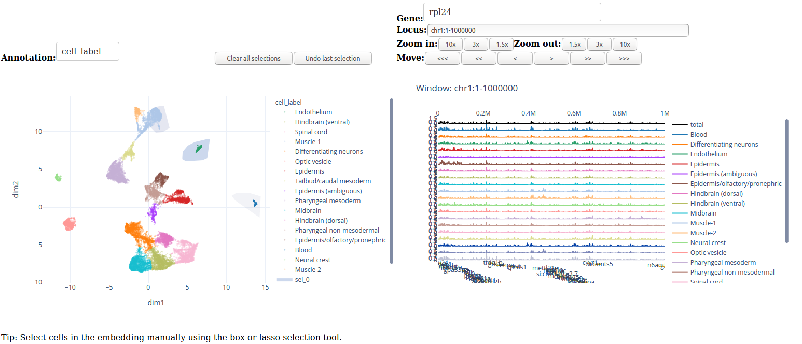

========
Overview
========

SCbrowse is an interactive browser for single-cell ATAC-seq data.
It allows to simultaneously explore the accessibility patterns
of selected cells in the embedding space and for selected genomic regions.
The tools freely available under a GNU Lesser General Public License v3 or later (LGPLv3+).

Example
==========

How can I select cells?
-----------------------

It is possible to select cells manually by selecting the "Lasso select" or "Box select"
in the navigation bar above the embedding scatterplot.
As a result, the area underneigth the selection will appear highlighted.

Can I select multipe cell populations?
--------------------------------------
Yes.

How can I deselect cells?
-------------------------

Above the scatter plot visualization, there are two buttons that
allow to undo the last selection or all selections.

How can I visualize accessibility at a locus or gene of interest?
------------------------------------------------------------------

On the top right, you can search and select a gene of interest 
or alternatively select genomic coordinates directly.
Using the zoom in/out and move functionality, allows to navigate 
and adjust the view along the locus.

Installation
============

The following lines show how to install scbrowse and its requirements
using conda

::

    conda create -n scbrowse python=3.7
    conda activate scbrowse
    conda install -c bioconda bedtools

    git clone https://github.com/BIMSBbioinfo/scbrowse
    pip install -e scbrowse[gunicorn]

Data preparation
================

SCbrowse needs two required ingredients:

1. A dataset stored in h5ad format which includes a raw countmatrix, cell annotation and precomputed embeddings.
2. Gene annotation in bed format

To prepare the dataset,
set up an AnnData dataset `adata = anndata.AnnData(...)`:
1. adata.X should contain a regions by cells raw sparse count matrix
2. adata.obs should contain the fields chrom, start and end, which define the genomic bins.
3. adata.var should contain the zero, one or several cell annotation tracks (categorical).
4. adata.varm should contain a 2D cell embedding stored as numpy array.
5. adata.uns should contain a entry 'embeddings' which lists the available keys for storing the embeddings in varm.

After preparation, the AnnData should look like this:

::

    >>> from anndata import read_h5ad
    >>> adata = read_h5ad('scbrowse.h5ad')
    >>> adata
    AnnData object with n_obs × n_vars = 1345115 × 23008
        obs: 'chrom', 'start', 'end'
        var: 'sample', 'cell_label', 'strain'
        uns: 'embeddings'
        varm: 'UMAP_all_cells'
    >>> adata.uns['embeddings']
    array(['UMAP_all_cells'], dtype=object)

Furthermore, to compile a countmatrix, consider using 
`scregseg <http://github.com/BIMSBbioinfo/scregseg>`_.
It offers functions for creating a countmatrix, including 
`scregseg make_tile`, `scregseg bam_to_counts` or `scregseg fragments_to_counts` as in the example below.
For example for a 1000 kp resolution countmatrix use:

::

    scregseg make_tile --bamfile <bam> --resolution 1000 --bedfile <outputbed>
    scregseg bam_to_counts --bamfile <bam> --counts <countmatrix> --regions <outputbed>

The best way to obtain cell embeddings is by first apply dimensionality reduction,
e.g. by running cisTopic, SnapATAC or any other tool of your choice.
Then create a 2D UMAP or t-SNE embedding for visualization and save it in the AnnData slot.

Using scbrowse (development mode)
=================================

To launch scbrowse in development mode, 
first, define the following environment variables
to point to the input files

::

    export SCBROWSE_MATRIX=<matrix.h5ad>
    export SCBROWSE_GENES=<genes.bed>
    export SCBROWSE_LOGS=<scbrowse.log>
    scbrowse

Afterwards you can browse the data locally in a web-browser by opening
https://localhost:8051

Deploy scbrowse in production mode
==================================

The simplest way to deploy scbrowse is via gunicorn.
The repository contains a  :code:`startup.sh` script
that launches the web server.
It needs to be adjusted to point to the input file locations.
Then run

::

    sh startup.sh

and open the scbrowse in a web browser at
https://localhost:8000

