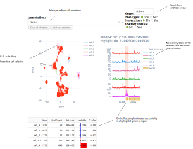

========
Overview
========

SCbrowse is an interactive browser for single-cell ATAC-seq data.
It allows to simultaneously explore the accessibility patterns
of selected cells in the embedding space and for selected genomic regions.
The tools freely available under a GNU Lesser General Public License v3 or later (LGPLv3+).

Navigation
==========

Installation
============

The following lines show how to install scbrowse and its requirements
using conda

::

    conda create -n scbrowse python=3.7
    conda activate scbrowse
    conda install -c bioconda bedtools

    pip install janggu[tf]
    pip install https://github.com/BIMSBbioinfo/scregseg/archive/master.zip

    git clone https://github.com/BIMSBbioinfo/scbrowse
    pip install -e scbrowse[gunicorn]

Data preparation
================

SCbrowse needs three required ingredients:

1. A genome-wide count matrix
2. 2D embedding of the cells
3. Gene annotation in bed format

The count matrix can be created from a BAM-file using scregseg.
For example for a 1000 kp resolution countmatrix use:

::

    scregseg make_tile --bamfile <bam> --resolution 1000 --bedfile <outputbed>
    scregseg bam_to_counts --bamfile <bam> --counts <countmatrix> --regions <outputbed>

A number of tools facilitate dimensionality reduction for
single-cell ATAC-seq data, including cisTopic or snapATAC.
Subsequently, UMAP, t-SNE (or any other 2D embedding algorithm)
can be used to create the embedding.
Eventually, scbrowse expects a tsv table with the embedding results
with the format

::

   barcode      dim1    dim2    annot.annot1    annot.annot2   ...

The first three columns (barcode, dim1 and dim2) are required.
They contain the barcode IDs and the embedding coordinates.
An arbitrary number of additional columns with prefix `annot.`
can be added to supply pre-defined (categorical) cell annotation.

Using scbrowse (development mode)
=================================

To launch scbrowse in development mode, 
first, define the following environment variables
to point to the input files

::

    export SCBROWSE_EMBEDDING=<embedding.tsv>
    export SCBROWSE_MATRIX=<matrix.npz>
    export SCBROWSE_REGIONS=<regions.bed>
    export SCBROWSE_GENES=<genes.bed>
    export SCBROWSE_LOGS=<scbrowse.log>
    scbrowse

Afterwards you can browse the data locally in a web-browser by opening
https://localhost:8051

Deploy scbrowse in production mode
==================================

The simplest way to deploy scbrowse is via gunicorn.
The repository contains a  :code:`startup.sh` script
that launches the web server.
It needs to be adjusted to point to the input file locations.
Then run

::

    sh startup.sh

and open the scbrowse in a web browser at
https://localhost:8000

